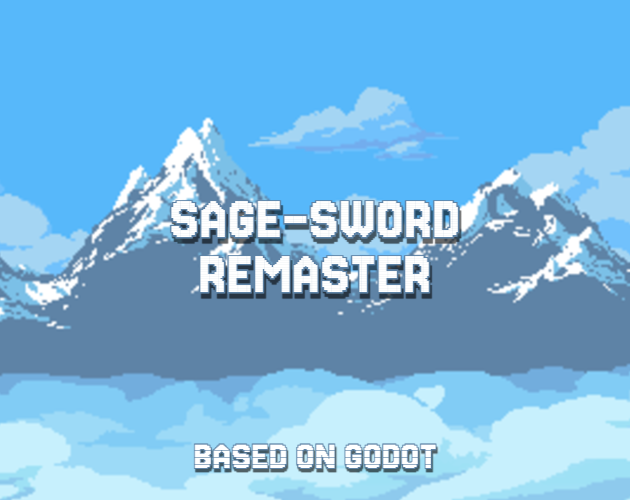

  <h1>⚔️ sage-sword-remaster</h1>
  
<em>Ремейк кликера <a href="https://github.com/drawksr/Sage-Sword-v0.1">Sage-Sword-v0.1</a> на Godot Engine</em>

  

  

    
    
    
    
  

<h2>🎮 Об игре</h2>

    <strong>sage-sword-remaster</strong> — это лёгкий и увлекательный 2D-кликер. 

    Особенность ремастера — смена игрового движка, .

<h2>✨ Особенности</h2>
<ul>
    <li>💡 Простая механика кликера</li>
    <li>⚔️ Улучшаемые модификаторы атаки</li>
    <li>👹 Новые враги каждые 10 уровней</li>
    <li>💾 Лёгкий запуск, минимальные системные требования</li>
</ul>

<h2>📸 Скриншоты</h2>

    
    
    

<h2>⬇️ Скачать</h2>

  👉 <a href="https://github.com/drawiks/sage-sword-remaster/releases/latest"><strong>Скачать последнюю версию</strong></a>

<ul>
    <li>Поддерживаемая платформа: <strong>Windows</strong></li>
</ul>

<h2>📅 Планы на будущее</h2>
<ul>
    <li>Добавить больше врагов и уровней.</li> 
    <li>Добавить новых игровых механик.</il>
    <li>Игровой режим дуэли.</il>
    <li>Улучшение визуальных эффектов и анимаций.</li>
</ul>

<h2>📜 Лицензия</h2>

  Игра распространяется под лицензией <strong>MIT</strong>.

